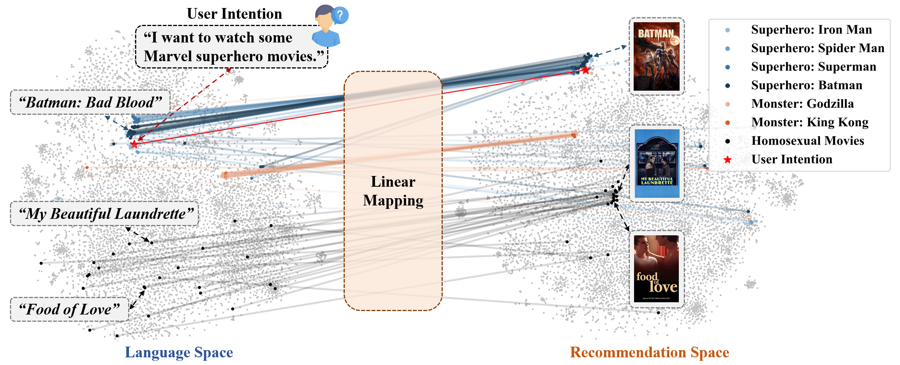
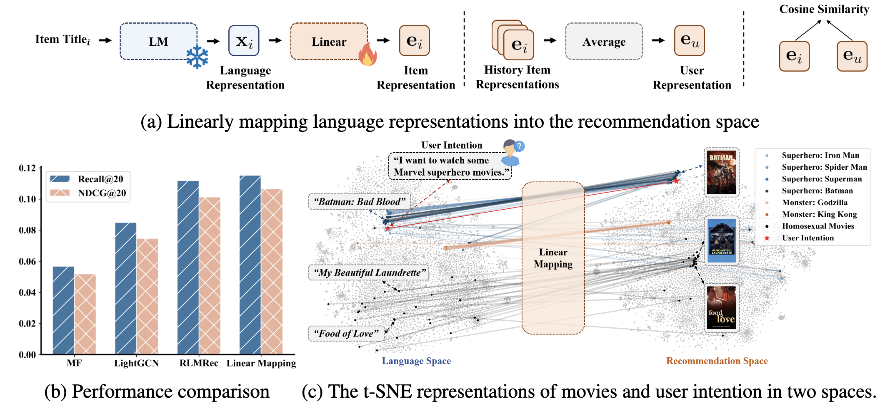
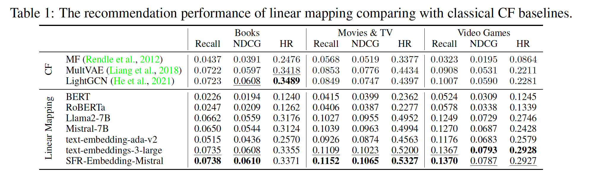
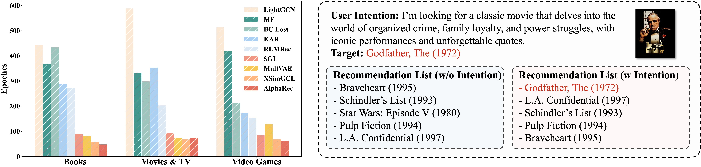
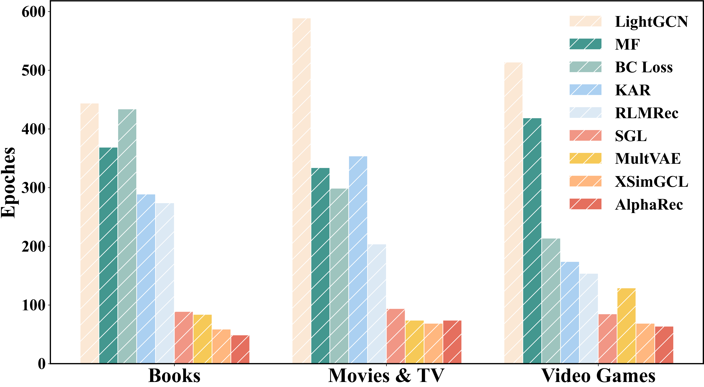

<div align=center>

<h1>Language Representations Can be What Recommenders Need: Findings and Potentials</h1>


<div>
      <a href="https://lehengthu.github.io//" target="_blank">Leheng Sheng</a><sup>1</sup>,
      <a href="https://anzhang314.github.io/" target="_blank">An Zhang</a><sup>1</sup><sup>*</sup>,
    <a href="https://github.com/zy20031230/" target="_blank">Yi Zhang</a><sup>2</sup>,
    <a href="https://github.com/chenyuxin1999/" target="_blank">Yuxin Chen</a><sup>1</sup>,
      <a href="https://xiangwang1223.github.io./" target="_blank">Xiang Wang</a><sup>2</sup>,
      <a href="https://www.chuatatseng.com/" target="_blank">Tat-Seng Chua</a><sup>1</sup>,

<div>
  <sup>1</sup>National University of Singapore, <sup>2</sup>University of Science and Technology of China
       </div>   
<div>
<sup>*</sup>Corresponding author. 
   </div>

</div>

<h2>Linear Mapping & Homomorphism</h2> 

<div style="width: 100%; text-align: center; margin:auto;">
      <!--  -->
    
</div>

<!-- <h2>Linear Mapping Performance</h2>  -->
<div style="width: 100%; text-align: center; margin:auto;">
      <!--  -->
    
</div>

</div>

By linear mapping the representations of language models (LMs), we can get a homomorphic item representation space for recommendation. We find that: 
- Homomorphic spaces generated by advanced LMs yield excellent recommendation performance.
- Semantic similarities in language representations may imply user preference similarities.
- The complicated user preference similarity may be implicitly encoded in language spaces, with a naive linear mapping matrix to activate.

## AlphaRec
Exploring the potential of advanced language representations with leading collaborative filtering (CF) components (i.e., nonlinear projection, graph convolution, and contrastive learning objective).

*"AlphaRec introduces a new language-representation-based CF paradigm with several desirable advantages: **being easy to implement, lightweight, rapid convergence, superior zero-shot recommendation abilities in new domains, and being aware of user intention**."*

### Rapid Convergence & User Intention Capture
<div style="width: 100%; text-align: center; margin:auto;">
      <!--  -->
    
</div>

<!-- <div style="display: flex; justify-content: center; align-items: center;">
  <div style="flex: 1; text-align: center;">
  <h3>Rapid Convergence</h3>
    
    
  </div>
  <div style="flex: 1; text-align: center;">
  <h3>User Intention Capture</h3>
    
    
  </div>
</div> -->

<!-- <div align=center>
<h2>Rapid Convergence</h2> 

<div style="width: 50%; text-align: center; margin:auto;">
      
</div>

<h2>User Intention Capture</h2> 

<div style="width: 70%; text-align: center; margin:auto;">
      
</div> -->
<!-- 
 -->

</div>


## ❓ How Does AlphaRec Interact with User Intentions?


https://github.com/user-attachments/assets/a77b4552-d144-4d7c-98c2-338a28c9a118


## 📋 TODO 

- [ ] Release user intention capture datasets.
- [ ] Upload zero-shot evaluation scripts.
- [ ] ...

## 👉 Quick Start for AlphaRec

### Dependencies

Our experiments have been tested on Python 3.9.12 with PyTorch 1.13.1+cu117. 🛎️ Python version over 3.10 may lead to some bugs in the package 'reckit'.

1. Set up a virtualenv and install the [pytorch](https://pytorch.org/get-started/previous-versions/) manually. After that, install all the dependencies listed in the `requirements.txt` file by running the following command:

```bash
pip install -r requirements.txt
```

2. Before using the general recommendation, run the following command to install the evaluator:
```bash
pushd models/General/base
python setup.py build_ext --inplace
popd
```

### Dataset downloading

Please download the datasets from the following anonymous link and put the unzipped dataset in the `data` folder:

https://drive.google.com/drive/folders/1iGKeTx3vqCtbeVdWkHOwgpbY3-s7QDy_?usp=sharing

Example of the file structure:
```
├── assets/
├── models/
├── data/
    ├── General/
        ├── amazon_movie/ # target datasets
            ├── cf_data/
            ├── item_info/
```

### Commands for running 
Books
```bash
nohup python main.py --rs_type General --clear_checkpoints --saveID tau_0.15_v3_mlp_ --dataset amazon_book_2014 --model_name AlphaRec --n_layers 2 --patience 20 --cuda 0 --no_wandb --train_norm --pred_norm --neg_sample 256 --lm_model v3 --model_version mlp --tau 0.15 --infonce 1 &>logs/amazon_book_2014_tau_0.15_v3_mlp__2.log &
```
Movies & TV
```bash
nohup python main.py --rs_type General --clear_checkpoints --saveID tau_0.15_v3_mlp_ --dataset amazon_movie --model_name AlphaRec --n_layers 2 --patience 20 --cuda 1 --no_wandb --train_norm --pred_norm --neg_sample 256 --lm_model v3 --model_version mlp --tau 0.15 --infonce 1 &>logs/amazon_movie_tau_0.15_v3_mlp__2.log &
```

Games
```bash
nohup python main.py --rs_type General --clear_checkpoints --saveID tau_0.2_v3_mlp_ --dataset amazon_game --model_name AlphaRec --n_layers 2 --patience 20 --cuda 2 --no_wandb --train_norm --pred_norm --neg_sample 256 --lm_model v3 --model_version mlp --tau 0.2 --infonce 1 &>logs/amazon_game_tau_0.2_v3_mlp__2.log &
```

## ☎️ Contact

Please contact the first author of this paper for queries.

- Leheng Sheng, leheng.sheng@u.nus.edu

## 🌟 Citation

You can cite this paper as follows if you find our work helpful:

```bibtex
@article{AlphaRec,
  title={Language Models Encode Collaborative Signals in Recommendation},
  author={Sheng, Leheng and Zhang, An and Zhang, Yi and Chen, Yuxin and Wang, Xiang and Chua, Tat-Seng},
  journal={arXiv preprint arXiv:2407.05441},
  year={2024}
}
```
